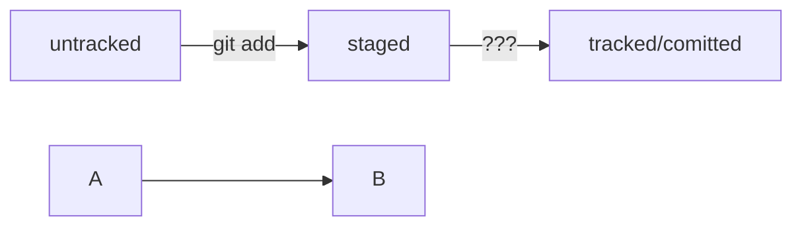

# git-hints

## Небольшой гит-репозиторий для самостоятельной работы

`git clone https://github.com/PraktikumJava/git-hints.git`

```mermaid
graph LR;
  untracked -- "git add" --> staged;
  staged    -- "???"     --> tracked/comitted;

%% стрелка без текста для примера: 
  A --> B;
```
